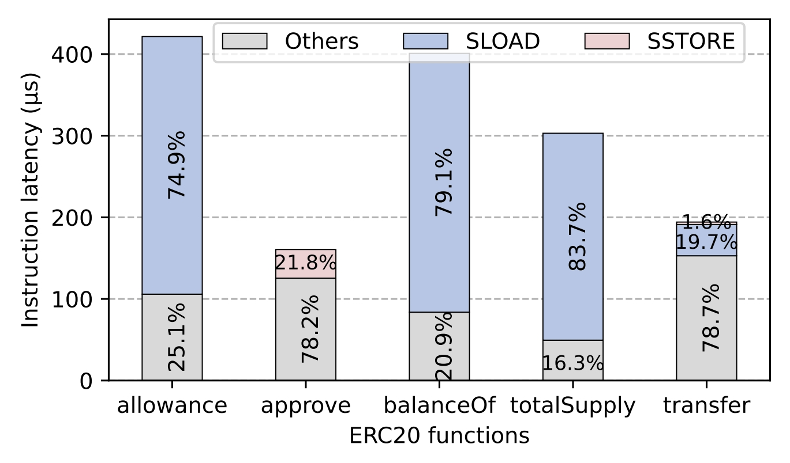

# CROSC
CROSC is a compilation-runtime joint optimization approach to accelerate smart contract execution, focusing on improving state access efficiency by minimizing direct access to costly persistent storage.
CROSC consists of three key parts:
1) a runtime memory management mechanism named Fast State Memory (FastSM) to fully utilize the working memory and provide the context for the contract compiler;
2) a State Variable Address Relocation (SVAR) strategy to minimize costly persistent storage operations by precisely redirecting state variable access targets during compilation;
3) a one-shot unpacking design that eliminates frequent decoding overhead for low-bitwidth state variables.

We implement CROSC based on Solc v0.8.18 and EVM embedded in Geth v1.11.0.

Extensive experimental results highlight that, compared with the baseline compilation and runtime system of Ethereum, CROSC can achieve 2.4× and 7.7× speedups for single state load and store operations, respectively. 
CROSC reduces state access latency by up to 81.3%, and overall contract execution latency by 29.7% on average across nine typical types of smart contracts.


Baseline compiler and client:
- [Solc v0.8.18](https://github.com/ethereum/solidity/tree/v0.8.18)
- [EVM embedded in Geth v1.11.0](https://github.com/ethereum/go-ethereum/tree/v1.11.0)


# Table of Contents 
<!-- Introduction -->
This repository includes 4 sub-directories as follows:
- ```benchmark``` Stores the smart contracts in our experimental benchmarks.
- ```crosc-geth``` Our implementation of contract runtime environment build on [Geth v1.11.0](https://github.com/ethereum/go-ethereum/tree/v1.11.0).
- ```crosc-solc``` Our implementation of contract compiler based on [Solc v0.8.18](https://github.com/ethereum/solidity/tree/v0.8.18).
- ```scripts``` Scripts for building Ethereum test network, and deploying and invoking smart contracts on test net.
- ```evaluation``` Stores the complete evaluation results, including execution time (latency),  number of instructions ( # of Instr.) and other performance metrics collected from running benchmarks on CROSC.


# Background
## Profiling on ERC20
We have performed a fine-grained performance profiling of smart contract execution at the instruction level by evaluating the famous ERC20 contract, as presented in the figure below: in most functions, the latencies of state load and store instructions, `SLOAD` and `SSTORE`, significantly exceed that of all the other instructions.
Take the *totalSupply* function as an example, which retrieves the total supply of tokens that have been minted.
In this function, the latency of the `SLOAD` instruction can account for 83.7% of the overall execution latency.
<!-- despite being executed only once. -->
<!--  -->

<div style="text-align: center;">
  
</div>


---

# How to use CROSC
## Environment requirements
```bash
// for building solc
GCC (version 11+)
CMake (version 3.21.3+)
Boost (version 1.67+)


// for building geth
Go (version 1.16+)
git


// for runing evaluation scripts
web3.py (version 5.31.4)
```

## Clone this repository
```bash
# Clone the source code
$ git clone https://github.com/shiningdai/crosc.git
```

## Build solc
```bash
# build solc
$ cd crosc/crosc-solc
$ mkdir build
$ cd build
$ cmake .. -DUSE_CVC4=OFF -DUSE_Z3=OFF
$ make
```

After completing the build of `solc`, you can use it to compile Solidity source code into bytecode. 
The bytecode and ABI file generated by the compilation can be deployed, invoked, and executed on the Ethereum chain built subsequently.

### example
Suppose the contract source code `sample.sol` stores in path: `crosc/crosc-solc/build/solc/test/sample.sol`.

```C++
// sample.sol
pragma solidity >=0.0;

contract Sample {
    uint128 sVar1 = 0;
    uint128 sVar2 = 100;
    
    function opVars() public returns(uint128){
        return sVar1 + sVar2;
    }
    
}
```


Compile the contract
```bash
$ cd crosc/crosc-solc/build/solc
$ ./solc ./test/sample.sol --abi --bin -o ./test/output/
```

Then you can get the generated contract bytecode and ABI file from path: `crosc/crosc-solc/build/solc/test/output`。
```bash
$ ls test/output/
Sample.abi  Sample.bin
```

## Build geth
The build and usage of Geth follow the same procedure as the original go-ethereum. 
For detailed instructions, please refer to [Geth v1.11.0](https://github.com/ethereum/go-ethereum/tree/v1.11.0). 
Note that Geth must be compiled using the source code provided in the crosc-geth directory of this repository.


## Setting Up the Ethereum Test Network

After building both `crosc-solc` and `crosc-geth` as described above, you can proceed to set up your own Ethereum test network using our customized runtime and compiler. This test network can be used to deploy, invoke, and execute smart contracts for benchmarking and evaluation.

The process of setting up the test network and interacting with smart contracts (e.g., deployment, invocation) follows the same workflow as the original [go-ethereum](https://github.com/ethereum/go-ethereum) and standard Ethereum development practices.

> **Note:**
> This repository does not aim to provide a comprehensive tutorial on testnet setup or smart contract operations. For detailed guidance, please refer to the many high-quality tutorials available online.

To facilitate the process, we provide several utility scripts under the `scripts/` directory. These scripts contain common tasks such as initializing the test network, deploying contracts, and invoking contract functions.

